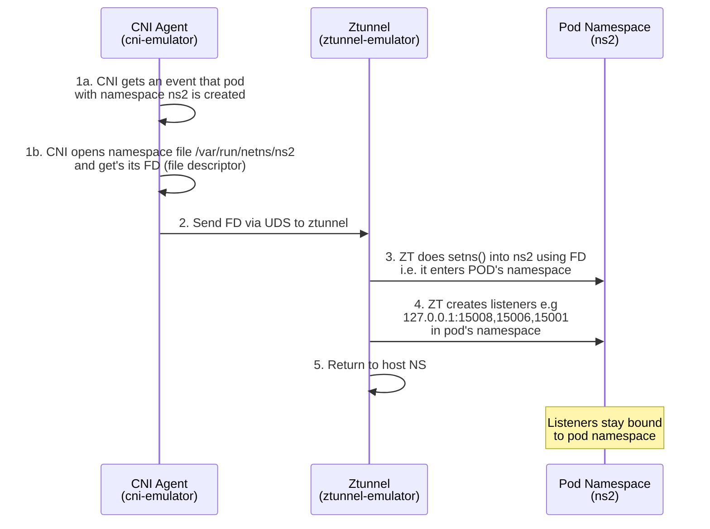

# Ztunnel CNI Handoff Flow Diagram

## Mermaid Diagram Code

## Alternative: Sequence Diagram

## Usage Instructions

1. Copy either diagram code above
2. Paste into [Mermaid Live Editor](https://mermaid.live/)
3. Export as PNG/SVG for your blog post
4. Or use in GitHub/GitLab markdown files directly
